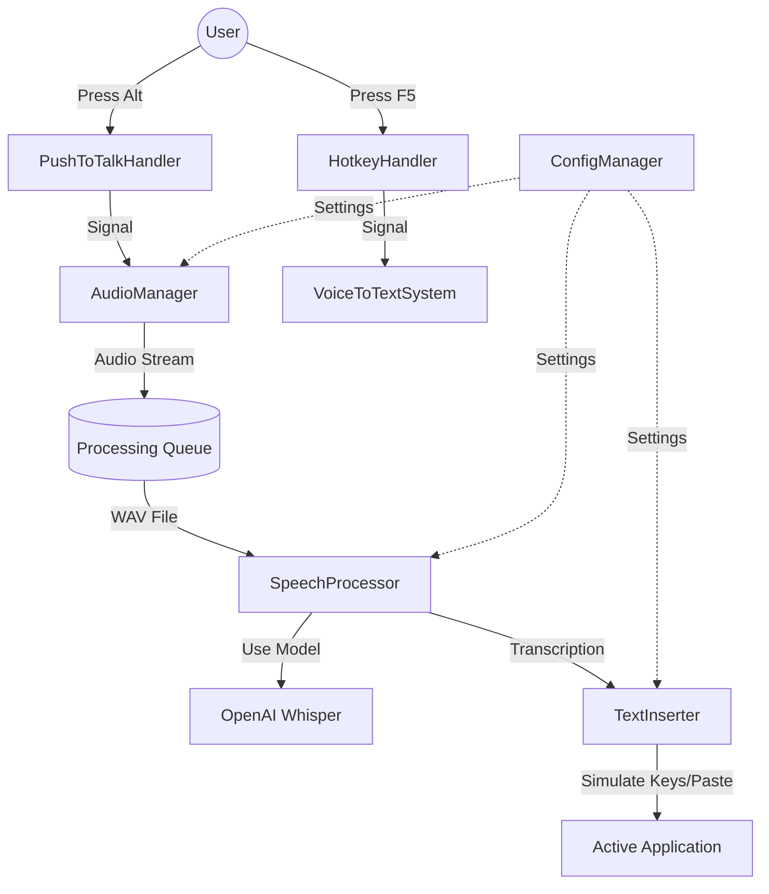

# Foundation Analysis Report - Voice-to-Text System

**Date:** 2025-12-13
**Auditor:** Antigravity (Google DeepMind)
**Scope:** `src/*.py`, `src/utils/*.py`, `config/`

## 1. Foundation Health Score
**RATING: SOLID (with minor caveats)**

The codebase is well-structured, modular, and follows good Python practices. Separation of concerns is respected, making it easy to trace data flow. However, the complete lack of true unit tests is a significant maintainability risk.

| Category | Score | Notes |
|----------|-------|-------|
| **Structural Integrity** | 🟢 A | Clear separation of concerns (Audio, Speech, Text, Config). |
| **Scalability** | 🟡 B | Single-user architecture is fine, but blocking transcription on main thread in some flows could be improved. Hardcoded `fp16=False` hurts performance on GPU. |
| **Maintainability** | 🟡 B- | Clean code and logging, but **ZERO unit tests**. |
| **Flexibility** | 🟢 A- | Good configuration system, though some app-specific logic is hardcoded. |

---

## 2. Issue Registry

| Severity | Issue | Location | Recommendation |
|----------|-------|----------|----------------|
| **CRITICAL** | **Missing Unit Tests** | `src/tests/*` | Create a `tests/` directory and add `pytest` suites for `SpeechProcessor` and `ConfigManager`. |
| **MAJOR** | **Hardcoded CPU Execution** | `src/speech_processor.py:74` | `fp16=False` forces CPU usage. Add config option to enable GPU/fp16 for supported hardware. |
| **MAJOR** | **Blocking Transcription** | `src/main.py:198` | Transcription blocks the processing flow. While it's in a callback, decoupling audio capture from processing via a queue would be more robust. |
| **MINOR** | **Hardcoded App List** | `src/text_insertion.py:206` | Move supported application list to `config.ini` or external JSON to allow user customization without code changes. |
| **MINOR** | **Broad Exception Handling** | `src/main.py`, `src/text_insertion.py` | overly broad `try...except Exception` blocks mask specific errors (e.g., permission denied vs file not found). |
| **MINOR** | **Missing Config Validation** | `src/utils/config_manager.py` | No validation that config values are within valid ranges (e.g. valid model names). |

---

## 3. Priority Action Plan

1.  **Initialize Test Suite (Est: 2 hours)**
    *   Set up `pytest`.
    *   Create mock-based tests for `TextInserter` and `ConfigManager` to ensure logic correctness without side effects.

2.  **Optimize Speech Processor (Est: 1 hour)**
    *   Make `fp16` and device selection (CPU/CUDA) configurable in `config.ini`.
    *   Validate model names against a source of truth.

3.  **Refactor Main Event Loop (Est: 3 hours)**
    *   Implement a `Queue` based architecture where `PushToTalkHandler` produces audio chunks and `SpeechProcessor` acts as a consumer worker. This prevents UI/Input freezing during heavy transcription.

4.  **Externalize App List (Est: 30 mins)**
    *   Move the list of supported apps in `TextInserter` to `SupportedApps` section in `config.ini`.

5.  **Add Type Hints & Docstrings (Est: 1 hour)**
    *   Complete type hinting (mypy compliance) to improve developer experience and catch bugs early.

---

## 4. Architecture Diagram

---

## 5. "If I Change X" Risk Map

| Modified File | Risk Impact | What Breaks? |
|---------------|-------------|--------------|
| `src/speech_processor.py` | **HIGH** | Changing model loading logic can break the first-run download or caching mechanism. Changing transcription result format breaks `TextInserter`. |
| `src/utils/audio_utils.py` | **HIGH** | Changing sample rate (16000Hz) breaks Whisper compatibility. Changing device index handling breaks audio on multi-mic systems. |
| `src/text_insertion.py` | **MEDIUM** | Changing clipboard fallback logic can cause "ghost pastes" (pasting user's previous clipboard). Modifying delays breaks insertion in slow apps (Electron apps like VS Code). |

---

## Summary
The system is built on a solid foundation. It works well for a single user. To scale or ensure long-term stability:
1.  **Add Tests**: This is the biggest gap.
2.  **Decouple Processing**: Move to a producer-consumer model for audio processing.
3.  **Expose Hardware Config**: Allow GPU usage.
